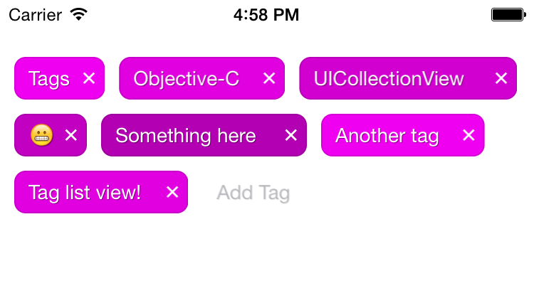

         _ _   _____ _____           _     _     _ __     ___               
        | | | |_   _|_   _|_ _  __ _| |   (_)___| |\ \   / (_) _____      __
     _  | | |   | |   | |/ _` |/ _` | |   | / __| __\ \ / /| |/ _ \ \ /\ / /
    | |_| | |___| |   | | (_| | (_| | |___| \__ \ |_ \ V / | |  __/\ V  V / 
     \___/|_____|_|   |_|\__,_|\__, |_____|_|___/\__| \_/  |_|\___| \_/\_/  
                               |___/                                        

# JLTTagListView  
JLTTagListView is a custom view for iOS apps, for when you need to show multiple editable tags.  
JLTTagListView handles adding and deleting tags, automatically moving to the next tag on return

## Usage  
1. Include `JLTTagListView` folder somewhere in your project  
2. Then in the class you want to use it `#import "JLTTagListView.h"`  
3. Create a mutable array of tags  
		
		 NSMutableArray *myTags = [NSMutableArray arrayWithObjects:@"tag1", @"tag2", nil];
4. Create an instance and add it to your view providing the list of tags 

		JLTTagListView *tagListView = [[JLTTagListView alloc]initWithFrame:self.view.frame tags:myTags baseColor:tagColor];
    	[self.view addSubview:tagView];
    	
JLTTagListView has the property `tags` which is an NSMutableArray of string objects. 

JLTTagListView also has the property `baseColor` which dynamically colours each tag a slight shade of your base colour, shown in the image above.

## Notes  
 JLTTagListView comes with [UICollectionViewLeftAlignedLayout](https://github.com/mokagio/UICollectionViewLeftAlignedLayout) to nicely layout the tags, you can change this up to whatever best suits your needs.
 
##License
The MIT License

Permission is hereby granted, free of charge, to any person obtaining a copy of this software and associated documentation files (the "Software"), to deal in the Software without restriction, including without limitation the rights to use, copy, modify, merge, publish, distribute, sublicense, and/or sell copies of the Software, and to permit persons to whom the Software is furnished to do so, subject to the following conditions:

The above copyright notice and this permission notice shall be included in all copies or substantial portions of the Software.

THE SOFTWARE IS PROVIDED "AS IS", WITHOUT WARRANTY OF ANY KIND, EXPRESS OR IMPLIED, INCLUDING BUT NOT LIMITED TO THE WARRANTIES OF MERCHANTABILITY, FITNESS FOR A PARTICULAR PURPOSE AND NONINFRINGEMENT. IN NO EVENT SHALL THE AUTHORS OR COPYRIGHT HOLDERS BE LIABLE FOR ANY CLAIM, DAMAGES OR OTHER LIABILITY, WHETHER IN AN ACTION OF CONTRACT, TORT OR OTHERWISE, ARISING FROM, OUT OF OR IN CONNECTION WITH THE SOFTWARE OR THE USE OR OTHER DEALINGS IN THE SOFTWARE.